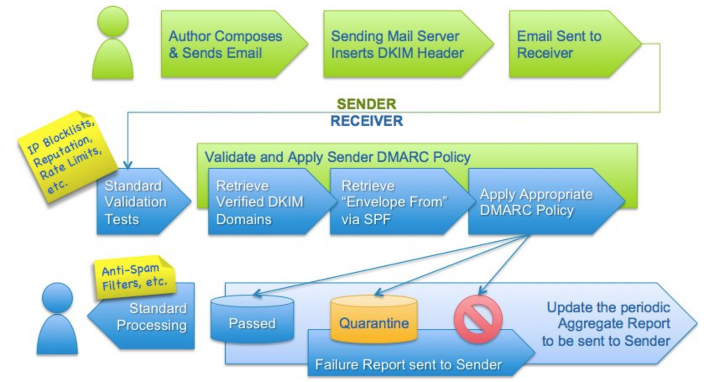

# Features

Copper Email Solution has been integrated many industry leading applicaitons to ensure most featurefull and secured email solution is delevered. Knowing each tool it was used will be good approach to know the solution well.

## MTA (Mail Transfer Agent ) - POSTFIX 

Postfix has been selected as the MTA in copper solution due to some of following advantages we found in postfix. To allow the server to send external emails, an MTA such as Sendmail, Postfix, or Exim is required. Mail is read either through direct access (shell login) or mailbox protocols like POP and IMAP. 
Postfix If you compare mail servers, then Postfix should be included, too, because it is also a popular mail server. It is a better mail server because it supports most of the current innovations in a modern-day mail server including but not limited to: • Virtual domains • SMTP relay • Consultation of SMTP client on its whitelist, grey list and blacklist databases • Host and user masquerading • Delivery to mailboxes with Maildir format As you compare mail servers, you will observe that Postfix utilises two large monolithic configuration files instead of the multiple task-oriented configuration files. You will then have to learn a single set of configuration file keywords. So we selected postfix considering It's popularity in integration projects and adaptability with new featues too.

Simple SMTP server.[POSTFIX](http://www.postfix.org).

## MDA (Mail Delevery Agent) - DOVECOT

Dovecot is an open source IMAP and POP3 email server for Linux/UNIX-like systems, written with security primarily in mind. Dovecot is an excellent choice for both small and large installations. It's fast, simple to set up, requires no special administration and it uses very little memory.

### Dovecot Advantages
1. Best performing
2. Standards compliant
3. Clustered filesystems compatibilty
4. Flexible authentification
5. postfix and exim supprt for smtp authentication
6. Security

 Flexible IMAP server.[DOVECOT](https://www.dovecot.org).

## SPAM FILTER - RSPAMD

Rspamd is an advanced spam filtering system that allows evaluation of messages by a number of rules including regular expressions, statistical analysis and custom services such as URL black lists. Each message is analysed by Rspamd and given a spam score.

According to this spam score and the user’s settings, Rspamd recommends an action for the MTA to apply to the message, for example, to pass, reject or add a header. Rspamd is designed to process hundreds of messages per second simultaneously, and provides a number of useful features.

Here is the list of C modules available bundled with rspamd.

1. chartable: checks character sets of text parts in messages.
2. dkim: performs DKIM signatures checks.
3. fuzzy_check: checks messages fuzzy hashes against public blacklists.
4. spf: checks SPF records for messages processed.
5. surbl: this module extracts URLs from messages and check them against public DNS black lists to filter messages with malicious URLs.
6. regexp: the core module that allow to define regexp rules, rspamd internal functions and lua rules.

### Lua modules

Lua modules are dynamically loaded on rspamd startup and are reloaded on rspamd reconfiguration. Should you want to write a lua module consult with the Lua API documentation. To define path to lua modules there is a special section named modules in rspamd:

    modules {
        path = "/path/to/dir/";
        path = "/path/to/module.lua";
        path = "$PLUGINSDIR/lua";
    }

If a path is a directory then rspamd scans it for `*.lua” pattern and load all files matched.

The following Lua modules are enabled in the default configuration (but may require additional configuration to work, see notes below):

1. antivirus - integrates virus scanners (requires configuration)
2. arc - checks and signs ARC signatures
3. asn - looks up ASN-related information
etc ******

Fast, free and open-source spam filtering.[RSPAMD](https://rspamd.com)

Comparisson with other spam filters. [SPAM FILTERS](https://rspamd.com/comparison.html)

## SPF - Sender Policy Framework 

Sender Policy Framework (SPF) is an email authentication method designed to detect forged sender addresses in emails (email spoofing), a technique often used in phishing and email spam.

SPF allows the receiver to check that an email claiming to come from a specific domain comes from an IP address authorized by that domain's administrators. The list of authorized sending hosts and IP addresses for a domain is published in the DNS records for that domain. 

1. Authorize email senders with SPF
2. Help prevent spoofing from your domain

Set up SPF to prevent spammers from sending unauthorized emails from your domain. This type of spamming is called spoofing. Sender Policy Framework (SPF) is an email security method to prevent spoofing from your domain. 

Spoofing is a common unauthorized use of email, so some email servers require SPF. If you don't set up SPF for your domain, messages could bounce or could be marked as spam.
Use SPF with DKIM and DMARC

Along with SPF,  we recommend setting up DomainKeys Identified Mail (DKIM) and Domain-based Message Authentication, Reporting & Conformance (DMARC). SPF validates the domains that can send messages. DKIM verifies that message content is authentic and not changed. DMARC specifies how your domain handles suspicious emails that it gets.

### Create an SPF record for your domain

An SPF record is a TXT record that lists the mail servers that are allowed to send email from your domain. Messages sent from a server that isn't the SPF record might be marked as spam. SPF originally used TXT records in DNS, which are supposed to be free-form text with no semantics attached. SPF proponents readily acknowledge that it would be better to have records specifically designated for SPF, but this choice was made to enable rapid implementation of SPF. In July 2005, IANA assigned the Resource Record type 99 to SPF. Later on, the use of SPF records was discontinued, and as of 2017, it is still necessary to use TXT records.
    

Fast, free and open-source spam filtering.[SPF](https://en.wikipedia.org/wiki/Sender_Policy_Framework)

Create TXT Record in DNS for SPF . [TXT Record Creation](https://mediatemple.net/community/products/dv/204404314/how-can-i-create-an-spf-record-for-my-domain)

## DKIM - DomainKeys Identified Mail 

DomainKeys Identified Mail (DKIM) lets an organization take responsibility for a message that is in transit.  The organization is a handler of the message, either as its originator or as an intermediary. Their reputation is the basis for evaluating whether to trust the message for further handling, such as delivery. Technically DKIM provides a method for validating a domain name identity that is associated with a message through cryptographic authentication. 
DKIM allows the receiver to check that an email claimed to have come from a specific domain was indeed authorized by the owner of that domain. It achieves this by affixing a digital signature, linked to a domain name, to each outgoing email message. The recipient system can verify this by looking up the sender's public key published in the DNS. A valid signature also guarantees that some parts of the email (possibly including attachments) have not been modified since the signature was affixed. Usually, DKIM signatures are not visible to end-users, and are affixed or verified by the infrastructure rather than the message's authors and recipients. 

DomainKeys Identified Mail .[DKIM](http://dkim.org/)
DKIM technical specification. [DKIM SPECIFICATION](https://en.wikipedia.org/wiki/DomainKeys_Identified_Mail)

## DMARK - Domain-based Message Authentication, Reporting & Conformance

DMARC, which stands for “Domain-based Message Authentication, Reporting & Conformance”, is an email authentication, policy, and reporting protocol. It builds on the widely deployed SPF and DKIM protocols, adding linkage to the author (“From:”) domain name, published policies for recipient handling of authentication failures, and reporting from receivers to senders, to improve and monitor protection of the domain from fraudulent email.
DMARC is designed to fit into an organization’s existing inbound email authentication process. The way it works is to help email receivers determine if the purported message “aligns” with what the receiver knows about the sender. If not, DMARC includes guidance on how to handle the “non-aligned” messages. For example, assuming that a receiver deploys SPF and DKIM, plus its own spam filters, the flow may look something like this:

 

Domain-based Message Authentication, Reporting & Conformance .[DMARK](https://dmarc.org)

## OPENLDAP - 

Openldap is used as the userbase and email server domain configuration management portal.
OpenLDAP is a free, open-source implementation of the Lightweight Directory Access Protocol (LDAP) developed by the OpenLDAP Project. It is released under its own BSD-style license called the OpenLDAP Public License.
LDAP is a platform-independent protocol. Several common Linux distributions include OpenLDAP Software for LDAP support. The software also runs on BSD-variants, as well as AIX, Android, HP-UX, macOS, Solaris, Microsoft Windows (NT and derivatives, e.g. 2000, XP, Vista, Windows 7, etc.), and z/OS. 

OpenLDAP has three main components:

    slapd – stand-alone LDAP daemon and associated modules and tools
    libraries implementing the LDAP protocol and ASN.1 Basic Encoding Rules (BER)
    client software: ldapsearch, ldapadd, ldapdelete, and others

Opensource LDAP server .[OPENLDAP](https://www.openldap.org/)

## PHPLDAPADMIN

PhpLdapAdmin is ued to mange the openldap server. It is simple and easy tool to mange openldap server.
phpLDAPadmin (also known as PLA) is a web-based LDAP client. It provides easy, anywhere-accessible, multi-language administration for your LDAP server.

Its hierarchical tree-viewer and advanced search functionality make it intuitive to browse and administer your LDAP directory. Since it is a web application, this LDAP browser works on many platforms, making your LDAP server easily manageable from any location.

phpLDAPadmin is the perfect LDAP browser for the LDAP professional and novice alike. Its user base consists mostly of LDAP administration professionals.
You might also like to see About. 

ldap adminsistration .[PHPLDAPADMIN](http://phpldapadmin.sourceforge.net/wiki/index.php/Main_Page)

## GroupOffice 

Group-Office is an enterprise CRM and groupware tool. Share projects, calendars, files and e-mail online with co-workers and clients. Easy to use and fully customizable. Its interfacea are userfriendly too. Copperoffice has used this CRM for its inbult webclient and for other groupware tools.

It includes following features.

*   Email Web client
*   Calendar 
*   Address Book
*   File sharing
*   Tasks
*   Notes
*   NewsLetters

GroupOffice CRM .[GROUPOFFICE](https://www.group-office.com)

## DOCKER

Docker is a tool designed to make it easier to create, deploy, and run applications by using containers. Containers allow a developer to package up an application with all of the parts it needs, such as libraries and other dependencies, and ship it all out as one package. By doing so, thanks to the container, the developer can rest assured that the application will run on any other Linux machine regardless of any customized settings that machine might have that could differ from the machine used for writing and testing the code.
In a way, Docker is a bit like a virtual machine. But unlike a virtual machine, rather than creating a whole virtual operating system, Docker allows applications to use the same Linux kernel as the system that they're running on and only requires applications be shipped with things not already running on the host computer. This gives a significant performance boost and reduces the size of the application.
For copper email system also use docker due to it's toola are written in many languages and may wanted specific operating systems. Furthe system deployment is far more easy with docker. Copper has created their own images and hosted in docker.hub which may be pull from the hub when the system is deployed in user environments.

Why docker .[DOCKER](https://opensource.com/resources/what-docker)

## Kubernetes

Kubernetes is an open source container orchestration engine for automating deployment, scaling, and management of containerized applications. The open source project is hosted by the Cloud Native Computing Foundation (CNCF). Copper uses kubernetes for the system orchestration due to number of advantages available with the wolds leading orchestration platform.

Kubernetes has a number of features. It can be thought of as:

    a container platform
    a microservices platform
    a portable cloud platform and a lot more.

Kubernetes provides a container-centric management environment. It orchestrates computing, networking, and storage infrastructure on behalf of user workloads. This provides much of the simplicity of Platform as a Service (PaaS) with the flexibility of Infrastructure as a Service (IaaS), and enables portability across infrastructure providers.
How Kubernetes is a platform

Kuubernetes .[DOCKER](https://kubernetes.io/docs/home/)
