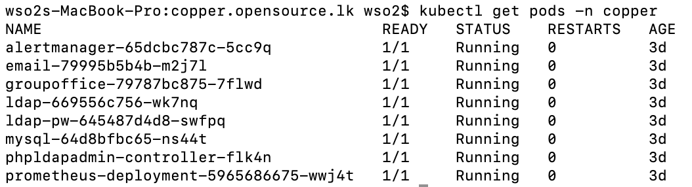
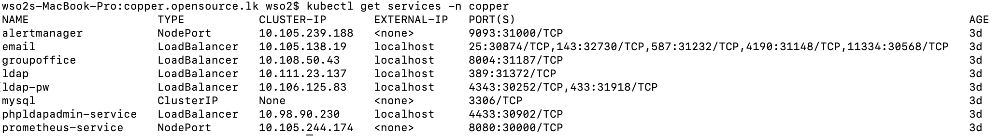

# Installation Process

## Installation

README.md file in the Deployment folder describe the installation process in detailed. It is the most updated one and please reffer it for more details. 

## Clone this Repository

```
$ git clone https://github.com/LSFLK/Copper.git
```


## Start the deployment
```
$ cd Copper/copper-server/kubernetes/deployment/
$ sh deploy.sh
```

## You may have to provide following informaiton while the installation process is going on.


    Enter mysql database name:

    Ex : copper

    Enter mysql database password:

    Ex : copper

    Your domain must contain 3 parts. (Eg: part1.part2.part3)
    Enter the first part of domain:

    Ex : copper

    Enter the second part of domain:

    Ex : test

    Enter the third part of domain:

    Ex : lk

    Enter LDAP admin password:

    Ex : admin

    Enter LDAP readonly user name:

    Ex : raa

    Enter LDAP readonly user password:

    Ex : raa

    Enter organization name

    Ex : lsf

    Enter password for spam filter (RspamD)

    Ex : spam

## Check kubernetes pods.

<p align="justify">

Then system installation process will begin. It will not take much time to install the system. But it is must to check kubernetes pods whether to know system is installed successfully. All pods status must be "Running".
</p>
```
$kubectl get pods -n copper
```



## Check kubernetes services.

<p align="justify">

Further kubernetes services also should be checked. All LoadBalancers External IP should be "localhost" and all nodeport's External IP should be  "<none>". PORTs can be seen from bellow command and 
</p>

```
$kubectl get services -n copper
```
