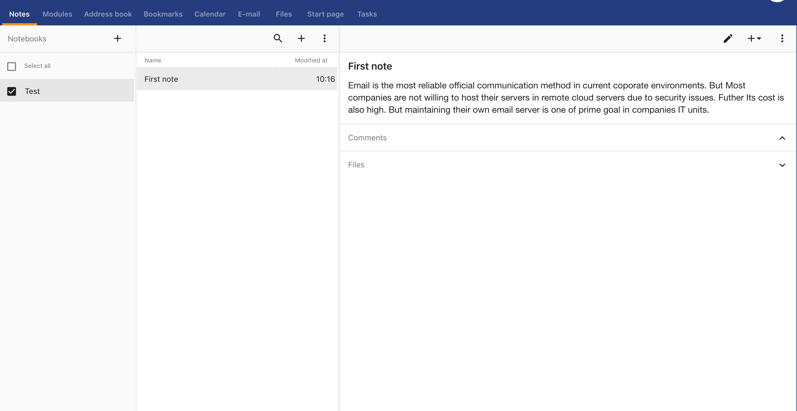
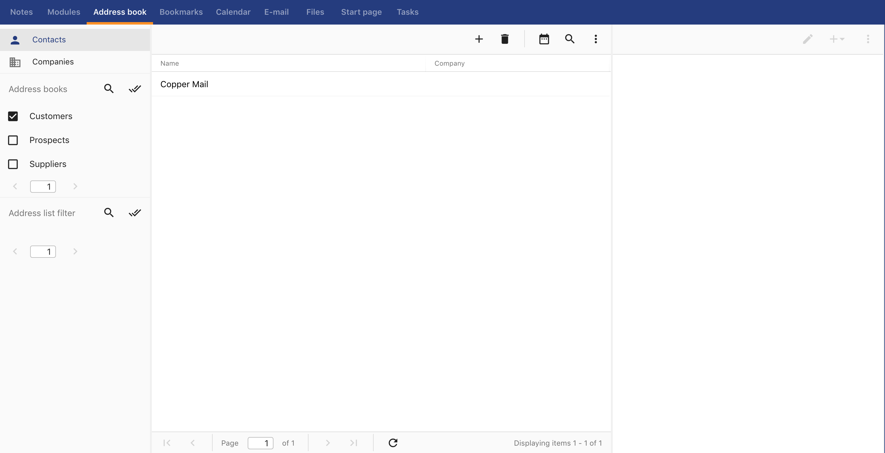
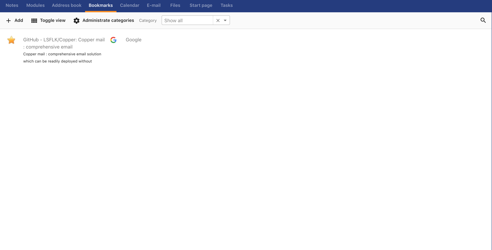
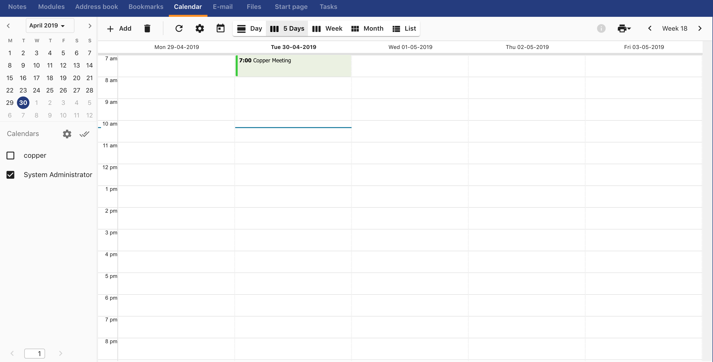
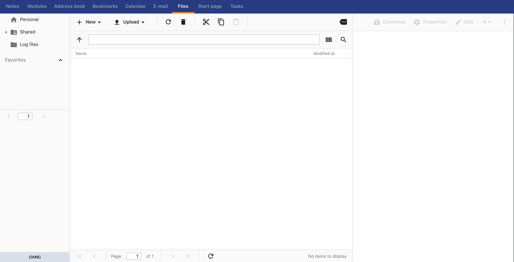
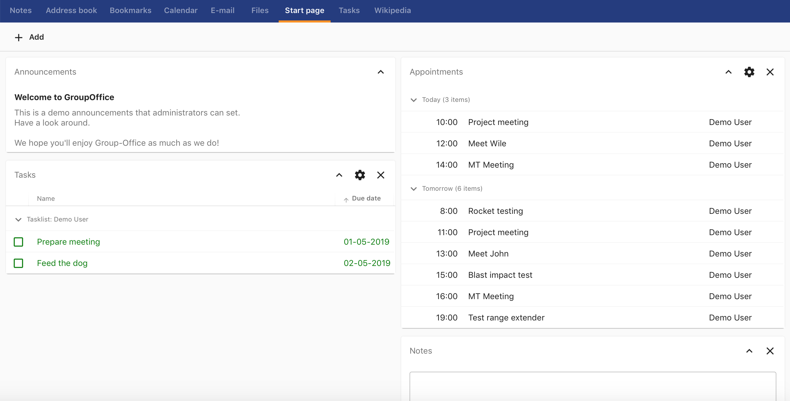
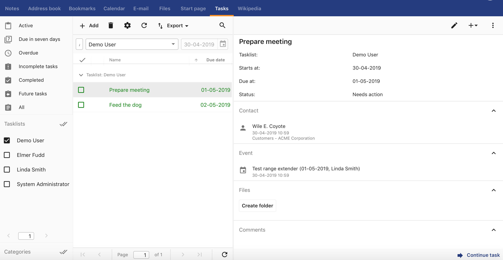

# Group-Office feature

Group-Office has a modern user interface with an attractive feture list. Group-Office is a PHP based dual license commercial/open source groupware and CRM and DMS product developed by the Dutch company Intermesh. The open source version, Group-Office Community, is licensed under the AGPL, and is available via SourceForge. 

### Feature list

#### Notes

<li>You can manage several notebooks according to your needs. </li>
<li>Can attach a notebook to e.g. email </li>
<li>Attach files with it </li>
<li>Notebook can be shared among users </li>
<li>Can link with tasks, calendar events, contacts etc… </li>

#### Address book

<li> Can link with tasks, calendar events, contacts etc… </li>
<li> Can directly send an email from contact </li>
<li> Can customize address book view  </li>
<li> Can maintain several address books </li>

#### Bookmark

<li> Can maintain a section of URL bookmarks for save and use (anywhere) important sites. </li>

#### Calendar

<li> Check event / meeting attendance (confirmed, maybe, no) </li>
<li> Allocate a location </li>
<li> Can send a recurrence notification </li>
<li> Can check availability through calendar </li>
<li> Can categorize calendar e.g. Dev Calendar, Events Calendar </li>
<li> Enabling reminders </li>

#### File storage

<li> Sharing is possible </li>
<li> Can create word document using system </li>
<li> Can be edited up to some level. (renaming) </li>
<li> Can have an expiration date </li>
<li> Can link with tasks, calendar events, contacts etc… </li>

#### Start page

<li> You can customize your own page with most relevant functionalities you want. </li>

#### Tasks

<li> Can have categories </li>
<li> Can link with tasks, calendar events, contacts etc… </li>
<li> Can recurrence notification </li>
<li> Can have reminders </li>
<li> Maintain status </li>
<li> Maintain priority level </li>
<li> Can have an expiration date </li>
<li> Have filters under several criteria </li>
<li> Can export </li>

